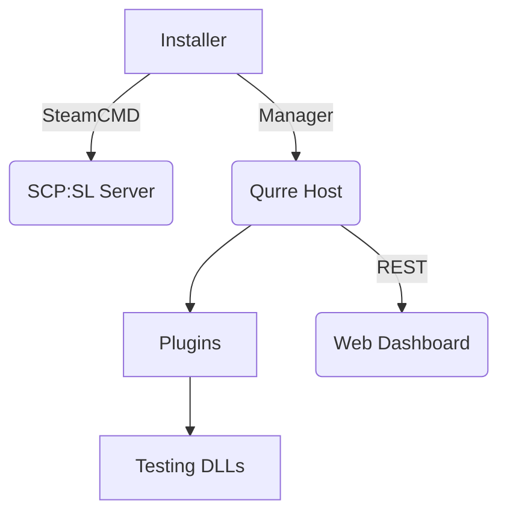

# qurre-host-try-2021 🛠️📦

> **qurre‑host‑try‑2021** — мои ранние попытки автоматизировать развёртывание серверов **Qurre** для *SCP: Secret Laboratory* (2021 год). Проект был заморожен из‑за нехватки опыта в то время, но остаётся в открытом доступе «как есть» — вдруг кому‑то пригодятся идеи или скрипты.

---

## 📂 Состав репозитория

| Директория             | Стек                       | Назначение                                                                        |
| ---------------------- | -------------------------- | --------------------------------------------------------------------------------- |
| **`create`**           | Node.js (`libvirt-node`)   | Черновой CLI‑инструмент, создающий виртуальную сеть/ВМ через **libvirt**.         |
| **`install`**          | Node.js + SteamCMD         | Авто‑установщик сервера *SCP*\*:SL\* (`appid 996560`) и менеджера **Qurre Host**. |
| **`module`**           | Node.js + конфиги          | XML‑шаблоны для NAT‑моста `br0` и статическая сетевые настройки.                  |
| **`web`**              | Express, MongoDB, HTML/CSS | Прототип панели управления: схемы Mongoose, статические ассеты дашборда.          |
| **`test`**             | .NET Assemblies            | Сборки *Qurre.dll* и зависимости для локального тестирования плагинов.            |
| **`qurre-installer*`** | Node.js CLI                | Несколько поколений экспериментальных установщиков Qurre Host.                    |

---

## 🚀 Быстрый старт (✖️ не рекомендуется в продакшн)

### 1. Развёртывание сервера *SCP*\*:SL\* + Qurre (Linux root VPS)

```bash
sudo apt update && sudo apt install nodejs tmux curl -y
git clone https://github.com/Shiro-nn/qurre-host-try-2021.git
cd qurre-host-try-2021/install
node qurre.js                  # скачает SteamCMD, сервер SCP:SL и Qurre‑manager
```

Скрипт установит SteamCMD, скачает актуальную версию игры, распакует свежий билд **Qurre** и запустит менеджер в tmux‑сессии `manager`.

### 2. Создание пробной ВМ через libvirt

```bash
cd create
sudo node qurre.js             # требует libvirt и root‑доступа
```

---

## 🧩 Мини‑архитектура



---

## 🛠️ Зависимости

* **Node.js 16+** и `npm` для всех JS‑скриптов.
* **libvirt** (для `create/`).
* **tmux**, **curl**, **wget** — устанавливаются автоматически скриптами `install/`.
* Минимум **2 ГБ RAM** и **2 ГБ свободного диска** для сервера *SCP*\*:SL\*.

---

## ⚠️ Статус проекта

Репозиторий **архивирован**: исправления и новые фичи не планируются. Используйте «как есть» и на свой страх и риск.

---

## ⚖️ Лицензия

Код распространяется под лицензией **MIT**. Подробнее — в файле `LICENSE`.
